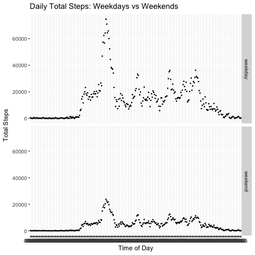

### About the Data

It is now possible to collect a large amount of data about personal movement using activity monitoring devices such as a Fitbit, Nike Fuelband, or Jawbone Up. These type of devices are part of the “quantified self” movement – a group of enthusiasts who take measurements about themselves regularly to improve their health, to find patterns in their behavior, or because they are tech geeks. But these data remain under-utilized both because the raw data are hard to obtain and there is a lack of statistical methods and software for processing and interpreting the data.

This assignment makes use of data from a personal activity monitoring device. This device collects data at 5 minute intervals through out the day. The data consists of two months of data from an anonymous individual collected during the months of October and November, 2012 and include the number of steps taken in 5 minute intervals each day.

The variables included in this dataset are: 

- **steps**: Number of steps taken in a 5-minute interval (missing values are coded as NA)
- **date**: The date on which the measurement was taken (YYYY-MM-DD format)
- **interval**: Identifier for the 5-minute interval in which measurement was taken (coded in a 24-hour format)

The dataset is stored in a comma-separated-value (CSV) file and there are a total of 17,568 observations in this dataset.

***

### Loading & Formatting the Data

As the data is stored as a CSV file, it can be easily read into R with the following:


```r
dataFile <- 'RepData_PeerAssessment1/activity.csv'
dat <- read.csv(dataFile, colClasses = c("integer","Date"))
```

We use the  _colClasses_ parameter to specify the class we need each column to take. We know that the first column will return a _number_ of steps, so we can assign that column to be an integer. The second column we know will contain dates in the YYYY-MM-DD format, and therefore we can tell R to read that column as dates.

Great! The data is loaded! Let's take a look.


```r
head(dat,16)
```

```
##    steps       date interval
## 1     NA 2012-10-01        0
## 2     NA 2012-10-01        5
## 3     NA 2012-10-01       10
## 4     NA 2012-10-01       15
## 5     NA 2012-10-01       20
## 6     NA 2012-10-01       25
## 7     NA 2012-10-01       30
## 8     NA 2012-10-01       35
## 9     NA 2012-10-01       40
## 10    NA 2012-10-01       45
## 11    NA 2012-10-01       50
## 12    NA 2012-10-01       55
## 13    NA 2012-10-01      100
## 14    NA 2012-10-01      105
## 15    NA 2012-10-01      110
## 16    NA 2012-10-01      115
```

The interval column appears to keep track of each hour in 5 minute increments. Let's fix this column to read more like a time than an integer:


```r
tempTime <- dat$interval
tempTime2 <- mapply(function(x, y) paste0(rep(x, y), collapse = ""), 0, 4 - nchar(tempTime))
tempTime <- paste0(tempTime2, tempTime)

dat$interval <- format(strptime(tempTime, format="%H%M"), format = "%H:%M")

head(dat,16)
```

```
##    steps       date interval
## 1     NA 2012-10-01    00:00
## 2     NA 2012-10-01    00:05
## 3     NA 2012-10-01    00:10
## 4     NA 2012-10-01    00:15
## 5     NA 2012-10-01    00:20
## 6     NA 2012-10-01    00:25
## 7     NA 2012-10-01    00:30
## 8     NA 2012-10-01    00:35
## 9     NA 2012-10-01    00:40
## 10    NA 2012-10-01    00:45
## 11    NA 2012-10-01    00:50
## 12    NA 2012-10-01    00:55
## 13    NA 2012-10-01    01:00
## 14    NA 2012-10-01    01:05
## 15    NA 2012-10-01    01:10
## 16    NA 2012-10-01    01:15
```

Ahh. That looks much better. Okay, let's get started!

***

### Data Analysis

##### I  Daily Steps

First, let's look at the average total steps taken per day. We can do this very easily using the _plyr_ package in R:


```r
library(plyr)   # load the plyr package
stepsPerDay <- ddply(dat, .(date), summarize, totalSteps = sum(steps,na.rm = TRUE))
head(stepsPerDay)
```

```
##         date totalSteps
## 1 2012-10-01          0
## 2 2012-10-02        126
## 3 2012-10-03      11352
## 4 2012-10-04      12116
## 5 2012-10-05      13294
## 6 2012-10-06      15420
```

We can look at how often the user took the daily step average by creating a histogram:


```r
with(stepsPerDay, 
     hist(totalSteps, 
          xlab = 'Total Number of Steps Per Day', 
          ylab = 'Frequency', 
          main = 'Histogram of Total Steps Per Day') )
```


Finally, we can calculate the average and median number of steps taken over the two month period:


```r
avgStepsPerDay <- round(mean(stepsPerDay$totalSteps, na.rm = TRUE))
medStepsPerDay <- round(median(stepsPerDay$totalSteps, na.rm = TRUE))
```


And conclude that during the months of October and November, this user was averaging  9354 steps per day, with the median number of steps equal to 10395.

***

#### II  Daily Activity Patterns
Let's take it a step further and look to see if we can find any patterns in the user's data. We can plot the average steps taken during each time interval (averaged across all days):


```r
stepsPerInterval <- ddply(dat, .(interval), summarize, totalSteps = sum(steps, na.rm = TRUE))
with(stepsPerInterval,
     plot(as.factor(interval), totalSteps, 
          type = "l",
          xlab = "Time of Day",
          ylab = "No. Steps",
          main = "Total Number of Steps During An Average Day") )
```


To find out exactly what time of day the most number of step are taken we perform the following:


```r
maxSteps <- max(stepsPerInterval$totalSteps, na.rm = TRUE)

timeOfDay <- stepsPerInterval[stepsPerInterval$totalSteps==maxSteps,]
```

And with that, we can note that the maximum number of steps are generally taken around 08:35 AM.

***

#### III  Imputing Missing Values

You probably saw that there are a few days that contain NA for the number of steps recorded at that day/interval. To calculate the number of missing values we can do this:


```r
numNA <- sum(is.na(dat$steps))
```

The total number of missing entries is 2304.

Instead of completely disregarding the NA values, let's replace them with the average number of steps taken during the missing interval. We can do that through the following:


```r
nas <- dat[is.na(dat$steps),]    # Isloate the NA values & time intervals

tmp <- 0
for (i in 1:nrow(nas)){
  tmp[i] <- stepsPerInterval[stepsPerInterval$interval==nas[i,3],2]
}
dat2 <- dat     # Duplicate original dataset
dat2$steps[is.na(dat$steps)] <- tmp    # Assign interval mean to NA intervals

head(dat2)
```

```
##   steps       date interval
## 1    91 2012-10-01    00:00
## 2    18 2012-10-01    00:05
## 3     7 2012-10-01    00:10
## 4     8 2012-10-01    00:15
## 5     4 2012-10-01    00:20
## 6   111 2012-10-01    00:25
```

To see what impact this had on the data, we can again plot a histogram of the total steps per day, and calculate the mean and median:


```r
stepsPerDay_replaceNA <- ddply(dat2, .(date), summarize, totalSteps = sum(steps))

with(stepsPerDay_replaceNA, hist(totalSteps, 
                              xlab = 'Total Number of Steps Per Day', 
                              ylab = 'Frequency', 
                              main = 'Histogram of Total Steps Per Day') )
```


```r
avgStepsPerDay_replaceNA <- round(mean(stepsPerDay_replaceNA$totalSteps))
medStepsPerDay_replaceNA <- round(median(stepsPerDay_replaceNA$totalSteps))
```

Previously, we found that the average steps per day equals 9354, and the median number of steps was 10395. When we replaced the missing data though, those values changed to 84188, and 11458, respectively.

By replacing the missing values, we have drastically changed the mean number of steps taken daily, as well as increased the median number of steps. 

***

#### IV  Weekday vs. Weekend Activity Patterns

Are there differences in activity patterns on weekends versus weekdays? We can start by assigning the labels weekday/weekend to the dates in our dataset. 


```r
wkdys <- weekdays(dat2$date)
weekends <- c("Saturday",'Sunday')
dat2[,4] <- factor((weekdays(dat2$date) %in% weekends), 
                   levels=c(FALSE, TRUE), labels=c('weekday', 'weekend')) 
head(dat2)
```

```
##   steps       date interval      V4
## 1    91 2012-10-01    00:00 weekday
## 2    18 2012-10-01    00:05 weekday
## 3     7 2012-10-01    00:10 weekday
## 4     8 2012-10-01    00:15 weekday
## 5     4 2012-10-01    00:20 weekday
## 6   111 2012-10-01    00:25 weekday
```

Next, let's plot the difference in the average daily steps between weekdays and weekends.


```r
library(ggplot2)

stepsPerInterval_repNA <- ddply(dat2, .(interval,V4), summarize, totalSteps = sum(steps))

p <- ggplot(stepsPerInterval_repNA, aes(as.factor(interval), totalSteps)) + geom_point(size = .3)
p + facet_grid(V4~.) +
    labs(x = "Time of Day", y = "Total Steps", title = "Daily Total Steps: Weekdays vs Weekends")
```



It does appear that more steps are taken during the week than on weekends.  
